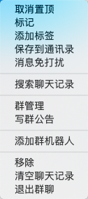
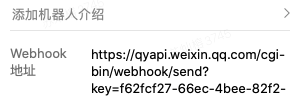
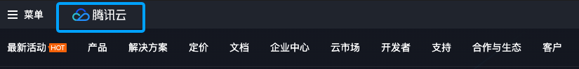
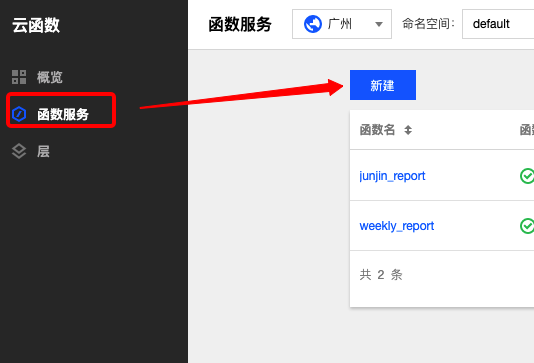
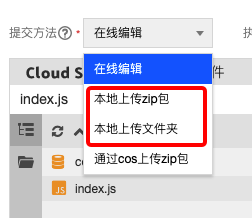
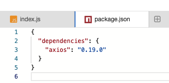
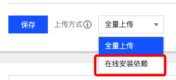

# 0资金成本给企业微信添加定时通知机器人

现在很多公司在工作上的沟通基本用的都是企业微信或者钉钉，工作上如果有一些周定时任务比如周报的填写或者是会议的提醒，如果单纯依靠人的记忆或者是他人的通知，未免过于浪费资源。所以，我们可以里利用一下企业微信或者钉钉的机器人，来为我们的工作提供一些便利。

## 工具准备
* 企业微信/钉钉
* 腾讯云账号一个

## 机器人文档
* [企业微信群机器人文档](https://work.weixin.qq.com/help?doc_id=13376)
* [钉钉群机器人文档](https://ding-doc.dingtalk.com/doc#/serverapi3/iydd5h)

企业微信与钉钉的机器人都是类似的，本篇文章将以企业微信为例子，介绍如何使用node.js撰写相关代码并将于腾讯云上创建云函数构建机器人定时通知任务。

首先我们需要创建一个机器人，右键群组选择添加机器人：

创建之后我们可以通过查看机器人的资料，获取到机器人的webhook地址：

向这个地址按照企业微信文档中提及的信息格式发起post请求，我们就能够在企业微信中收到相关的信息（这里的话建议新建一个群组，然后把其他人都踢走，这样群里就会只剩下你一个人，调试的时候就不用担心会影响到其他人）。

接下来，为了稳定地、定时地、非本地地向发起post请求，我们需要申请一个腾讯云账号。

* [腾讯云登录注册入口](https://cloud.tencent.com/login?s_url=https%3A%2F%2Fconsole.cloud.tencent.com%2Fscf%2Flist-create%3Frid%3D1%26ns%3Ddefault)

点击腾讯云并在下面的热门中找到云函数的入口:

进入云函数的主页面之后选择函数服务并新建函数

在填写基本信息页面，填写好函数名之后选择语言node.js 8.9并选择官方提供的helloworld模板，该模板会为我们创建基本的2个文件config.json与index.js，我们主要撰写的内容都集中在index.js文件中,接着点击下一步，点击完成。

接着回到函数撰写的页面，我们可以直接在网页上编写代码，如果有需要一些第三方的依赖如node-fetch/axios，我们可以在本地npm install对应的依赖，然后根据官方的格式，上传文件或者是文件夹。

如果选择在线编辑的话，则需要创建一个新的package.json文件，在对象的dependency中写上第三方依赖的及对应的版本号，然后在上传方式旁边选择在线安装依赖即可。

前期准备工作做完。
